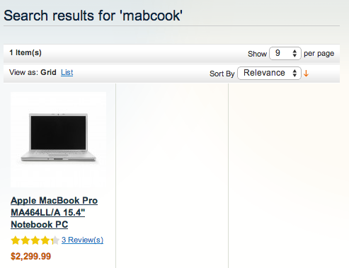
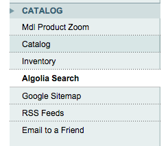
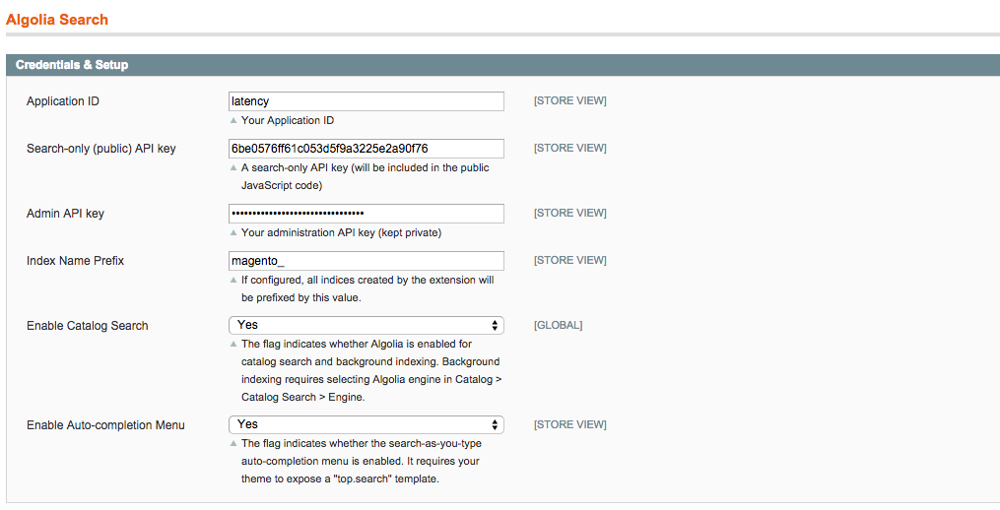
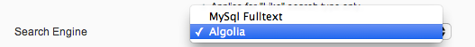
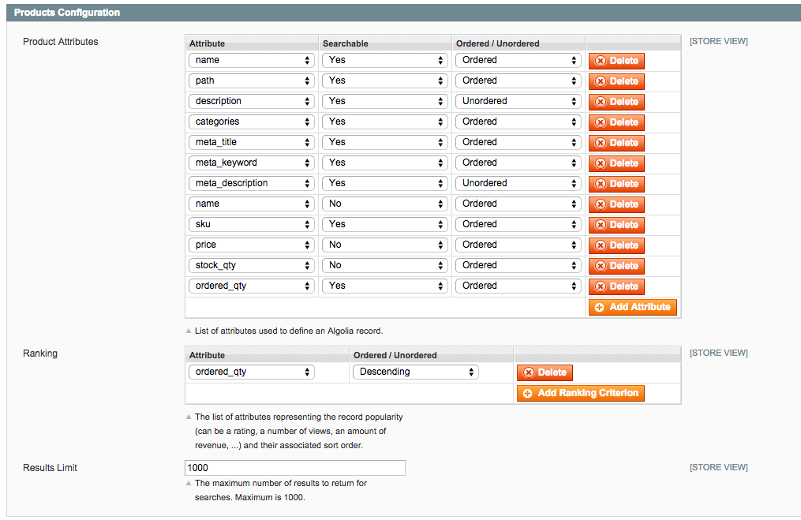
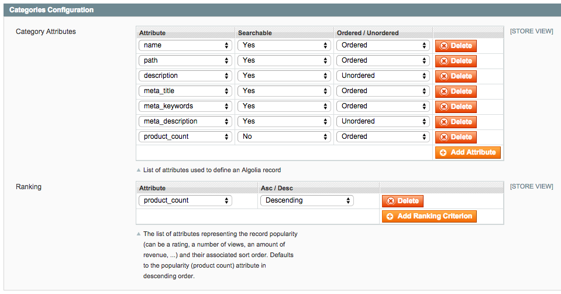
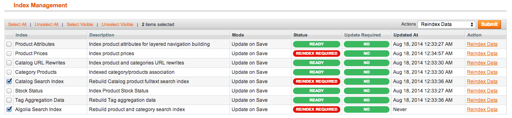

Algolia Search for Magento
==================

[Algolia Search](http://www.algolia.com) is a hosted full-text, numerical, and faceted search engine capable of delivering realtime results from the first keystroke.

This extension replaces the default search of Magento with a typo-tolerant, fast & relevant search experience backed by Algolia. It's based on [algoliasearch-client-php](https://github.com/algolia/algoliasearch-client-php) and [algoliasearch-client-js](https://github.com/algolia/algoliasearch-client-js).


See features and benefits of [Algolia Search Extension for Magento](https://www.algolia.com/with/magento).


Installation
--------------

### Using Magento-Connect

To setup this module using the packaged Community Extension, download the last version from [the magento-connect store](http://www.magentocommerce.com/magento-connect/algolia-search-extension.html).

### Using Modman

To setup this module using [modman](https://github.com/colinmollenhour/modman) (a module manager for Magento) run the following commands:

```sh
$ cd /path/to/your/magento/directory
$ modman init
$ modman clone https://github.com/algolia/algoliasearch-magento.git
```

### Using Composer

To setup this module using [Composer](https://getcomposer.org/) (a dependency manager for PHP), just add ```"algolia/algoliasearch-magento": "1.1.*"``` to your ```composer.json``` file.

Features
--------

### Search bar with auto-complete

This extension adds an auto-completion menu to your search bar displaying products and categories "as-you-type".


### Typo-tolerant full-text search

This extension replaces the default full-text search feature of your Magento instance providing you a typo-tolerant & relevant search experience.




Configuration
--------------

To setup this module, you'll need an Algolia account. Just sign up [here](http://www.algolia.com/users/sign_up) to create an account and retrieve your credentials.

### Credentials & Activation

Once the extension is installed, a new **Algolia Search** menu will appear in your **System > Configuration** menu.



In the first block of the configuration panel, you'll be able to setup your credentials and to enable to search features.

To replace Magento's default Full-Text search algorithm by Algolia, set **Enable Catalog Search** to `Yes`. To add an auto-completion menu to your search bar, set **Enable Auto-completion Menu** to `Yes`.



Once done, go to **System > Catalog > Catalog Search > Search Engine** and select **Algolia** as the Search Engine used to search your catalog.




### Products Configuration

This section of the configuration allows you to configure how your **Product** records will look like in Algolia. List here all the attributes you need to search, rank and display your products. The order of this setting matters as those at the top of the list are considered more important.

Use the **Ranking** configuration to specify the numerical attribute used to reflect the popularity of your products. By default, we recommend using the number of ordered quantity as popularity criteria.



### Categories Configuration (auto-completion menu only)

This section of the configuration allows you to configure how your **Category** records will look like in Algolia. List here all the attributes you need to search, rank and display your categories. The order of this setting matters as those at the top of the list are considered more important.

Use the **Ranking** configuration to specify the numerical attribute used to reflect the popularity of your categories. By default, we recommend using the number of products in the category as popularity criteria.



Initial import
-----------------

Once configured, do not forget to trigger the re-indexing in **System > Index Management**:




Instant-search
---------------

FIXME


Development
------------
The easiest way to setup your development environment is to use [Docker](https://www.docker.com/). Just run the following script to setup a runnin Magento 1.9 instance with some sample data & the Algolia Search extension installed:

```sh
$ ./dev/restart.sh -a YourApplicationID \
               -k YourAdminAPIKey \
               -s YourSearchOnlyAPIKey \
               -p YourIndexPrefix \
               -b http://YourBaseURL/
```

Administration login is `admin` with password `magentorocks1`.
