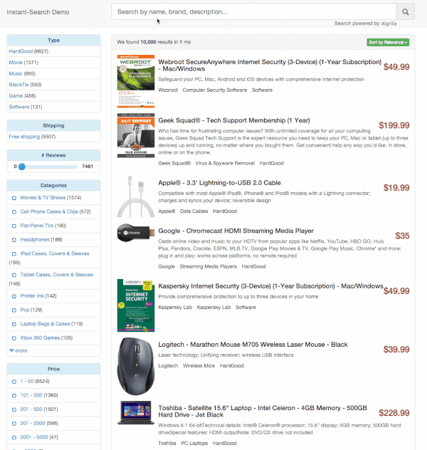

Algolia Search for Magento
==================

[Algolia Search](http://www.algolia.com) is a hosted full-text, numerical, and faceted search engine capable of delivering realtime results from the first keystroke.

This extension replaces the default search of Magento with a typo-tolerant, fast & relevant search experience backed by Algolia. It's based on [algoliasearch-client-php](https://github.com/algolia/algoliasearch-client-php) and [algoliasearch-client-js](https://github.com/algolia/algoliasearch-client-js).

See features and benefits of [Algolia Search Extension for Magento](https://community.algolia.com/magento).


Documentation
--------------

Check out our documentation on [community.algolia.com/magento](https://community.algolia.com/magento/documentation/).

Demo
--------------

You can check out our [live demo](https://magento.algolia.com).

### Auto-completion menu

Offer End-Users immediate access to your whole catalog from the dropdown menu, whatever your number of categories or attributes.


### Instant search results page

Have your search results page, navigation and pagination updated in realtime, after each keystroke.




Contribute to the Extension
------------

### 1. Docker (recommended)

The easiest way to setup your development environment is to use [Docker](https://www.docker.com/). If you're a Mac user, use [boot2docker](http://boot2docker.io/) to run docker containers.

#### Setup the docker instance

Just run the following script to setup a running Magento 1.9.1 instance with some sample data & the Algolia Search extension installed:

```sh
$ ./dev/restart.sh -a YourApplicationID \
               -k YourAdminAPIKey \
               -s YourSearchOnlyAPIKey \
               -p YourIndexPrefix \
               -b http://`boot2docker ip`/ # change that if you're not using boot2docker
```

#### Administration panel

Administration login is `admin` with password `magentorocks1` and you can access it from `http://[boot2docker ip]/admin`.

#### Phpmyadmin

A phpmyadmin instance is available from `http://[boot2docker ip]/phpmyadmin`

#### Shell

You can execute a shell inside the container with the following command:

```sh
$ docker exec -i -t algoliasearch-magento /bin/bash
```

### 2. Modman

If you do not want to use docker. You can use [modman](https://github.com/colinmollenhour/modman) (a module manager for Magento) by running the following commands:

```sh
$ cd /path/to/your/magento/directory
$ modman init
$ modman clone https://github.com/algolia/algoliasearch-magento.git
```
